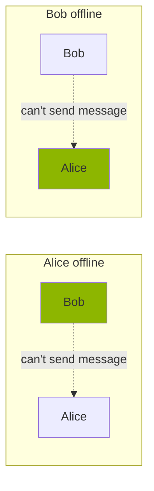
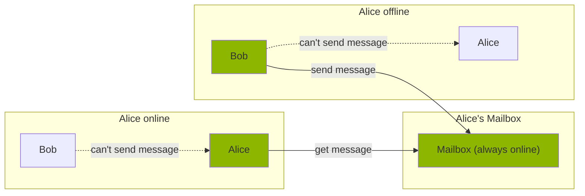

# Anonomi Postbox

## What this is — and what it is not

Anonomi Postbox exists to solve a real constraint of peer-to-peer systems
**without reintroducing centralized control**.

Anonomi messages are exchanged directly between contacts.
There are no servers. No accounts. No global infrastructure.

That model maximizes privacy —
but it also means message delivery depends on **overlapping availability**.

In hostile, mobile, or unstable environments, that assumption does not hold.

Postbox exists to extend reachability **without betraying the threat model**.

It is not a platform.
It is not a service.
It is not a convenience layer owned by someone else.

It is user-controlled infrastructure.

---

## The problem: availability without centralization

Pure peer-to-peer messaging requires both parties to be online at the same time.

When one side is offline, messages stall — sometimes indefinitely.

This is not a bug.
It is the cost of refusing central servers.

But in mobile networks, under power constraints, or in high-risk conditions,
availability is inconsistent by default.

Postbox addresses this **without turning Anonomi into a platform**.

---

## The solution: a postbox you control

Anonomi Postbox is a **store-and-forward buffer** operated by the user,
not by a company or network operator.

It is:

- Always online (relative to a phone)
- Stable (home internet, fixed power)
- Reachable over Tor
- Owned and operated by the user

Contacts can leave encrypted messages for the postbox owner.
The owner retrieves them when they reconnect.

No global directory.
No shared infrastructure.
No third-party custody.

Postbox improves reachability **without creating a server worth seizing**.

---

## Threat-model alignment

Postbox is designed under the same assumptions as Anonomi:

- Networks are monitored
- Traffic may be blocked or delayed
- Devices may be inspected
- Contacts may be compromised over time

As a result:

- All connections occur over **Tor**
- The Postbox has **no knowledge of message contents**
- The Postbox does **not establish identity**
- The Postbox does **not create accounts**
- The Postbox does **not become a hub**

If Postbox cannot be operated safely, it should not be operated at all.

---

## What Postbox deliberately does NOT do

Postbox is intentionally limited.

It does **not**:

- Act as a relay for arbitrary users
- Provide global reachability
- Maintain user directories
- Replace peer-to-peer delivery
- Introduce push services tied to third parties

Postbox exists to **extend availability**, not to recentralize communication.

---

## Hardware & deployment philosophy

Postbox is designed to be deployable with minimal friction
and minimal trust assumptions.

Initial target:

- **Android application**
- A spare phone
- Stable power
- Stable internet

No special hardware required.

Future deployments may include:

- GNU/Linux servers
- Raspberry Pi
- Any Java-capable environment

The operator always remains the owner.

---

## Features

### Core capabilities

- Contacts can store messages for the postbox owner
- The owner can store messages for contacts to retrieve later
- All communication occurs over Tor
- Messages remain end-to-end encrypted

### Extended / optional components

- Group message synchronization to increase message circulation
- Alternative transports (LAN, Wi-Fi Direct, Bluetooth)
- Push-like wake mechanisms to reduce phone battery drain

All extensions are evaluated against the threat model first.

---

This does not change the trust model.
It only changes the hardware.

---

## This infrastructure is not neutral

Postbox is not designed to serve platforms, institutions, or scale-seeking actors.

It is built for users who:

- Cannot rely on always-on connectivity
- Cannot afford centralized intermediaries
- Need availability **without surveillance**
- Operate under real constraints

If you are looking for convenience, there are easier tools.
If you are looking for control, this one makes trade-offs explicit.

---

## Open source & verification

Anonomi is developed transparently and in public.

Security relies on:
- Public, auditable source code
- Independent review
- The ability to fork, reproduce, and verify builds

---

## Contributing

Anonomi is under active development, with a strong focus on security,
resilience, and real-world adversarial environments.

Contributions of all kinds are welcome:

- Android development
- Networking & transport layers
- Cryptography review
- UX for high-risk users
- Documentation & threat analysis

See [CONTRIBUTING.md](./CONTRIBUTING.md)

---

## Contact

For security-related matters, responsible disclosure, or project coordination,
you can contact the Anonomi maintainers at:

**anonomi@protonmail.com**

Proton Mail access:
- Clearnet: https://proton.me
- Tor (official Proton Mail Tor entry):
  https://protonmailrmez3lotccipshtkleegetolb73fuirgj7r4o4vfu7ozyd.onion/

Please avoid sharing sensitive operational details unless strictly necessary,
and prefer encrypted communication when appropriate.

---

## Support & sustainability

Anonomi is independent and community-supported.

Support may include:
- Code contributions
- Infrastructure
- Testing devices
- Financial support

Financial contributions are accepted in a privacy-respecting way:

**Monero (XMR) — preferred**

https://anonomi.org/paylinks/d/#5ece7ffb-fcea-4a8f-9de9-73d1ec8a5ce7

Powered by Anonomi Paylinks — each donation generates a fresh subaddress for privacy.

**Bitcoin (BTC) — accepted (public by default)**

`bc1qqjw2qyj276jkwdd0wxm4y4vyggsmr73y9nm066`

For QR codes, and updated donation information, see:
https://anonomi.org/#supporters
(onion mirror soon available)

Part of the project's resources are used to support the Tor ecosystem
by running relays and bridges.

**Sponsorship does not equal influence.**

---

## License

Anonomi is free and open source software, licensed under the
**GNU General Public License v3.0 (GPL-3.0)**.

This means you are free to:
- Use the software for any purpose
- Study how it works and modify it
- Redistribute it
- Distribute modified versions

Under the following conditions:
- Source code (including modifications) must be made available under the same license
- License notices and attributions must be preserved
- No additional restrictions may be imposed on users' freedoms

Anonomi derives from the Briar project and other GPL-licensed components.
All required attributions and license notices are included in this repository.

See the [LICENSE](./LICENSE) file for full details.

---

## Disclaimer

Anonomi is designed for real-world adversarial environments, but no software
can eliminate all risk.

Users are responsible for understanding their own threat model,
operational security, and legal context.

Privacy is a condition you defend — not a checkbox you enable.
